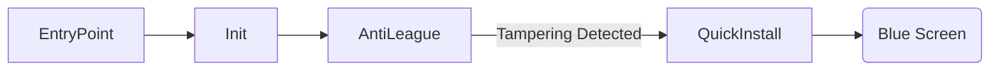
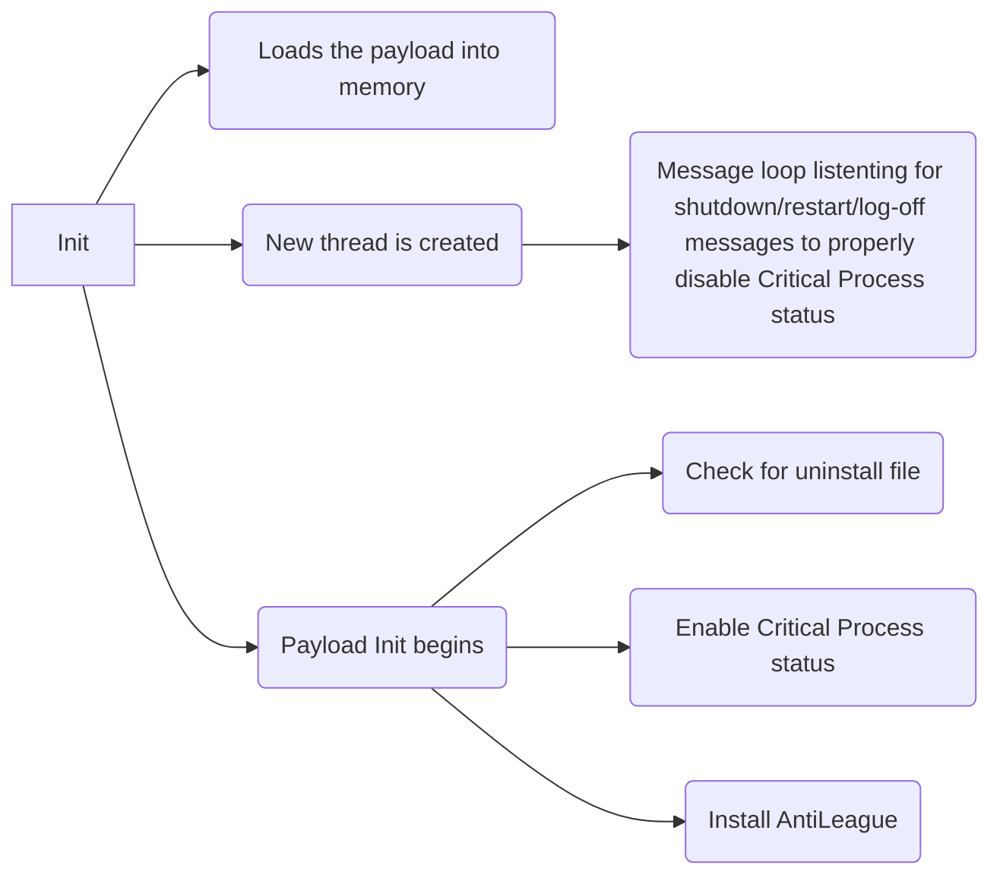
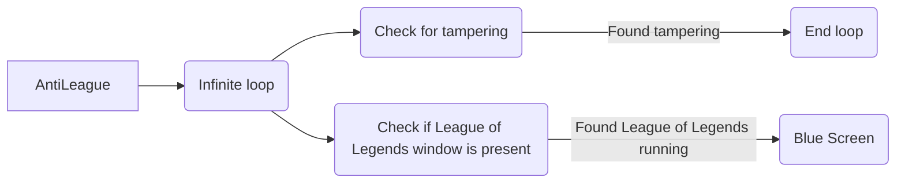

# AntiLeague

AntiLeague brings only the best for its users. This program is designed to Blue Screen your computer when `League of Legends` is opened, preventing you from playing. This program will singlehandedly save the world.

## Note

AntiLeague was made realtively quickly and is not a perfect project. It was made as a joke. Don't expect this to bypass antivirus or to be entirely foolproof. There are a handful of ways to bypass this just thinking off the top of my head. It's not so easy that you can task end it; however, it's not impossible to remove.

## AntiLeague Procedure

On the first run, the program will install itself; however, it will notice it is running in the wrong position and blue screen. When the computer restarts, the program will be properly installed and running as a `Critical Process` preventing termination. On any case that the window `League of Legends` is found, the program will blue screen the computer. There is a `persistence/anti-tamper system` built into AntiLeague as noted in the [**Compilation Process**](#compilation-process) section. Some of these methods are monitored, which means that when tampering with such a method is detected, the program will repair it and then blue screen.

> **IMPORTANT:** AntiLeague blue screens during the first run, on any detection of tampering with certain persistence methods, and when League of Legends is opened. Be careful when performing any of those tasks to prevent file corruption or any other problems.

### Installation

Make sure `AntiLeague.exe` is alongside the corresponding payload and then simply run. Your computer will blue screen on the first run; however, after restart it should be installed.

### Uninstallation

To uninstall AntiLeague, create a file on your desktop named as the `uninstall code` specified in [stdafx.h](/AntiLeague%20Payload/src/stdafx.h) and restart. This file should have **no** extension. **E.g.** `LEteh33ZUY` Once restarted, you will be prompted to confirm the uninstall.

## Compilation Process

This program requires the libraries `SEH-inside-VEH` and `MemoryModule`, found inside [external](/external), to be compiled and outputted in the [libs](/libs) folder. 

Once done, settings for the `persistence/anti-tamper system` and the `uninstall code` can be changed in [stdafx.h](/AntiLeague%20Payload/src/stdafx.h). Simply comment out settings you don't want and vice-versa. The `uninstall code` is a string that **must** be **10** characters long.

After compiling, `SEH-inside-VEH` requires `patching RtlUnwind`. Instructions for this can be found in [Patching RtlUnwind](https://github.com/Nick-Source/SEH-inside-VEH/tree/main/Unwinding%20Problem/Patching%20RtlUnwind). `SEH-inside-VEH` is statically linked so follow the corresponding instructions. These steps should be done for both `AntiLeauge.exe` and `AntiLeague Payload.dll` binaries. While it may be possible to only have it done for `AntiLeague Payload.dll`, it is safer and easier to have both patched.

After patching, the binary `AntiLeague Payload.dll` must be `XOR encrypted` with a key that is exactly **10** characters long. Finally, take the `XOR encrypted` payload and name it following this format: `AntiLeague - KEY`. Replace `KEY` with the **10** character key used to encrypt the payload. **E.g.** `AntiLeague - LEteh33ZUY`

The unencrypted payload can be discarded now. Keep the `XOR encrypted` payload in the same folder as `AntiLeague.exe` and run the program or ship those two files.

## Broken-down Figures

### Init

### AntiLeague

### QuickInstall

This function simply re-installs the program with the specified persistence/anti-tamper settings in [stdafx.h](/AntiLeague%20Payload/src/stdafx.h).
